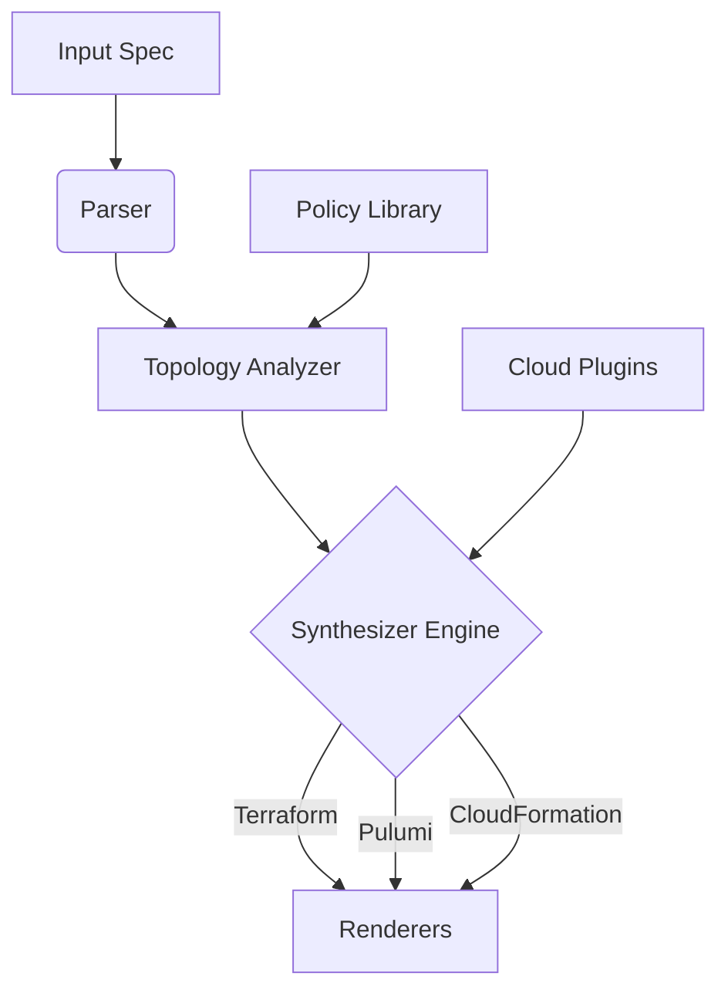

# NebulaForge: Cloud-Native Infrastructure Synthesizer  

**[](https://opensource.org/licenses/MIT)**  
**[](https://github.com/nebulaforge/nebulaforge/actions)**  
**[](https://nebulaforge.io/docs)**  

## Overview  
NebulaForge is a cloud-agnostic infrastructure synthesis engine that generates declarative Infrastructure-as-Code (IaC) configurations for heterogeneous cloud environments. Based on abstract infrastructure definitions, it produces production-grade Terraform, Pulumi, and CloudFormation manifests while maintaining deterministic idempotency guarantees.  

## Key Features  
- **Multi-Cloud Orchestration**: Unified abstraction layer for AWS, GCP, Azure, and Kubernetes  
- **Declarative Synthesis**: Generates Terraform (v1.5+), Pulumi (v3.0+), and AWS CloudFormation templates  
- **Topology Analysis**: Real-time dependency resolution for network and service architectures  
- **Policy Integration**: Embedded Open Policy Agent (OPA) engine for compliance validation  
- **Extensible Templates**: Modular template system with Helm-like override semantics  

## Quick Start  

### Installation  

**npm**:  
```bash  
npm install -g @nebulaforge/cli  
```  

**Docker**:  
```bash  
docker pull nebulaforge/core:stable  
```  

### Basic Usage  
1. Declare infrastructure requirements in `my_infra.nebula`:  
```yaml  
project:  
  id: ecommerce-platform  
  providers: [aws, gcp]  

workloads:  
  - type: container-service  
    replicas: 6  
    compute:  
      cpu: 2  
      memory: 4Gi  
```  

2. Generate Terraform configurations:  
```bash  
nebulaforge synthesize -i my_infra.nebula -o ./generated -t terraform  
```  

3. Deploy:  
```bash  
cd generated/terraform  
terraform init && terraform apply  
```  

## Architecture  


## Configuration Reference  

### Input Specification Schema  
```yaml  
project:  
  id: string  
  version: semver  
  providers: enum[aws,gcp,azure,k8s]  

network:  
  cidr: string  
  subnets:  
    - name: string  
      type: public|private  
      availabilityZone: string  

workloads:  
  - type: container-service|serverless|vm-cluster  
    compute:  
      cpu: integer  
      memory: string  
      gpu: boolean  
```  

## Advanced Usage  

### Policy Enforcement  
```hcl  
# compliance.rego  
package nebula.policy  

default allow = false  

allow {  
  input.workloads[_].compute.memory >= "2Gi"  
  input.network.cidr == "10.0.0.0/16"  
}  
```  
Validate infrastructure definitions:  
```bash  
nebulaforge validate --policy ./compliance.rego  
```  

### Custom Templates  
1. Create template directory:  
```bash  
mkdir -p templates/azure  
```  

2. Implement `main.tf.tpl`:  
```hcl  
resource "azurerm_linux_virtual_machine" "{{.resource_id}}" {  
  size = "{{.compute.size}}"  
  admin_username = "nebula_admin"  
}  
```  

3. Synthesize with custom templates:  
```bash  
nebulaforge synthesize --template-dir ./templates  
```  

## Contributing  
1. Report bugs via [GitHub Issues](https://github.com/nebulaforge/nebulaforge/issues)  
2. Submit feature requests using RFC templates  
3. Follow [CONTRIBUTING.md](https://github.com/nebulaforge/nebulaforge/blob/main/CONTRIBUTING.md) for PR guidelines  

## License  
MIT License. See [LICENSE](https://github.com/nebulaforge/nebulaforge/blob/main/LICENSE).  

## Disclaimer  
NebulaForge is not officially supported by any cloud provider. Generated configurations must undergo security review before production deployment.

---
> [!NOTE]
> **Portfolio Demonstration**: This project is a showcase of technical writing and documentation methodology. It is intended to demonstrate capabilities in structuring, documenting, and explaining complex technical systems. The code and scenarios described herein are simulated for portfolio purposes.