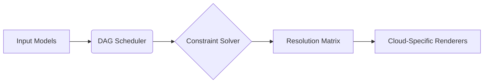

# NebulaForge Architecture Overview

## 1. Architectural Philosophy
NebulaForge employs a constraint-based synthesis approach to infrastructure composition, implementing principles from formal verification and declarative programming. The system adheres to three foundational axioms:

1. **Idempotent Synthesis**: Repeated processing of identical inputs yields identical infrastructure graphs
2. **Immutable Artifacts**: All synthesized configurations produce versioned, crytographically-hashed outputs
3. **Orthogonal Abstraction**: Cloud provider specifics are decomposed into independent capability dimensions

## 2. Core Components

### 2.1 Orchestration Engine
The stateful coordinator implementing the synthesis workflow:

- **DAG Scheduler**: Manages topology calculation through constraint propagation
- **Versioned Artifact Store**: Immutable storage for intermediate synthesis products
- **Cross-Cloud Resolution**: Normalization engine for provider-specific capability matching



### 2.2 Policy Decision Point
The policy enforcement subsystem:

| Layer          | Responsibility                     | Implementation              |
|----------------|------------------------------------|-----------------------------|
| Attribute      | Resource metadata validation       | OPA/Rego policies           |
| Temporal       | State transition constraints       | Temporal workflow guards    |
| Structural     | Topology composition rules         | Graph transformation rules  |

### 2.3 Cross-Cloud Abstraction Layer (XCAL)
Provider-agnostic capability modeling:

```typescript
interface CloudCapability {
  compute: {
    vcpu: number;
    architecture: 'x86' | 'arm';
    isolation: 'shared' | 'dedicated';
  };
  storage: {
    type: 'block' | 'object' | 'file';
    redundancy: number;
  };
  network: {
    throughput: number; // Gbps
    latencyClass: 'standard' | 'low';
  };
}
```

## 3. Synthesis Workflow

1. **Input Conditioning**
   - Normalize multi-source inputs (HCL, JSON, proprietary DSLs)
   - Establish baseline constraint set
   - Generate capability requirement matrix

2. **Topology Expansion**
   - Resolve abstract resources to cloud-specific implementations
   - Apply structural transformation rules
   - Verify policy compliance at intermediate states

3. **Artifact Generation**
   - Render cloud-native IaC configurations
   - Produce environment-specific packaging (Terraform modules, CloudFormation templates)
   - Generate verification manifests and compliance reports

## 4. State Management Model
NebulaForge implements a three-tier state representation:

**Logical State**: Developer-defined desired configuration  
**Materialization State**: Cloud-ready resource definitions  
**Operational State**: Live infrastructure status (post-deployment)

State transitions are governed by the following state machine:

```
                  +---------------+
                  |  Logical      |
                  |  (Declared)   |
                  +-------+-------+
                          |
                          v
                  +-------+-------+
         +------->| Materialized  |<------+
         |        | (Synthesized) |       |
         |        +-------+-------+       |
         |                |               |
+--------+------+ +-------+-------+ +-----+--------+
| Drift Detection| | Configuration| | Environment  |
| (Reconciliation)| | Generation  | | Specialization|
+---------------+ +---------------+ +--------------+
```

## 5. Key Architectural Characteristics

### 5.1 Intent Preservation
Guarantees maintenance of developer intent through synthesis phases:
- Semantic tagging of input elements
- Provenance tracking via bidirectional tracing
- Behavioral equivalence verification

### 5.2 Non-Blocking Validation
Early fault detection through staged verification:
1. Static analysis of input models
2. Dynamic evaluation using constraint solver
3. Dry-run execution against cloud provider APIs

### 5.3 Multi-Cloud Consistency
Standardized capability surfaces enabling:
- Uniform policy application across providers
- Deterministic mapping of abstract resources
- Comparable cost estimation models

## 6. Execution Environment
The platform runtime implements cloud-native primitives:

- **Control Plane**: Kubernetes-native operators managing synthesis jobs
- **Data Plane**: Per-tenant isolated processing environments
- **Observability**: Distributed tracing through OpenTelemetry instrumentation

## 7. Compliance Framework
Embedded regulatory adherence through:

- Automated NIST SP 800-53 control mapping
- Continuous CIS Benchmark validation
- GDPR Article 32 technical measure verification

This architecture enables NebulaForge to deliver verifiably correct infrastructure specifications while maintaining flexibility across heterogeneous cloud environments.